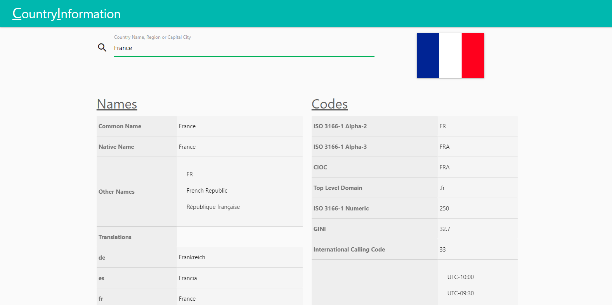

# Country Information App 🌍

Get information about countries via a RESTful API. Search by country name, capital city or region.

> [Project Demo 🔗](https://countryinformation.netlify.app)

## Built With 🛠

* [Materialize CSS](https://materializecss.com/) - Materialize is a modern responsive CSS framework based on Material Design by Google.
* [Animate CSS](https://animate.style/) - Animate.css is a library of ready-to-use, cross-browser animations for you to use in your projects.
* [Chart JS](https://www.chartjs.org/) - Simple, clean and engaging HTML5 based JavaScript charts. Chart.js is an easy way to include interactive graphs on your website.

## Screenshot 🖼

